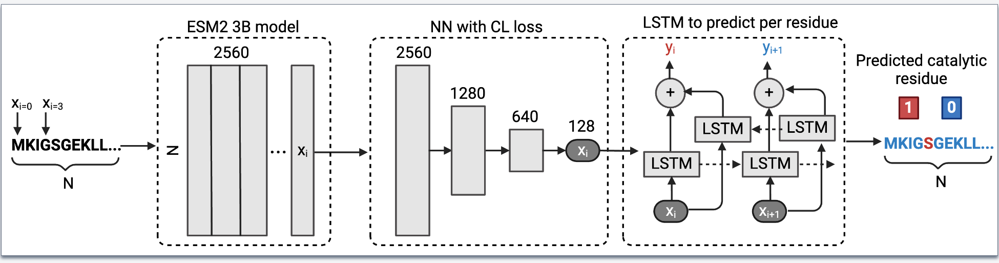
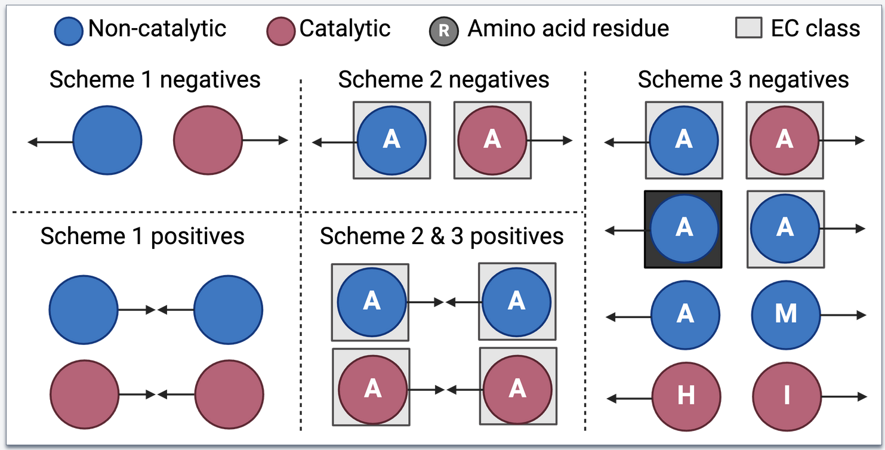

# 🦑Squidly


Squidly, is a tool that employs a biologically informed contrastive learning approach to accurately predict catalytic residues from enzyme sequences. We offer Squidly as ensembled with Blast to achieve high accuracy at low and high sequence homology settings.

publication:
blah

## 📥 Installation
### Requirements
Squidly is dependant on the ESM2 3B or 15B protein language model. Running Suidly will automatically attempt to download each model.
The Smaller 3B model is lighter, runs faster and requires less VRAM. 

Table with requirements:
3B: 
15B: 

### Installation Steps
```bash
# Clone the repository
git clone https://github.com/yourusername/Squidly.git
# Install dependencies
./install.sh # Makes the squidly conda env

# Build and install
python setup.py sdist bdist_wheel
pip install dist/squidly-0.0.1.tar.gz 
```

Torch with cuda 11.8+ must be installed.
https://pytorch.org/get-started/locally/

## Usage
For example to run the 3B model with a fasta file:
```bash
squidly AEGAN_with_active_site_seqs_NN.fasta esm2_t36_3B_UR50D
```

Note you can also save to other directories and also save the name see help for details.

```bash
                                                                                   
 Usage: squidly [OPTIONS] FASTA_FILE ESM2_MODEL [OUTPUT_FOLDER] [RUN_NAME] [BLAST_CUTOFF]                                                                        
                                                                                                                                                    
 Find cataltic residues using Squidly and BLAST                                                                                                                          
                                                                                                                                                    
╭─ Arguments ──────────────────────────────────────────────────────────────────────────────────────────────────────────────────────────────────────╮
│ *    fasta_file         TEXT             Full path to query fasta or csv (note have simple IDs otherwise we'll remove all funky characters.)     │
│                                          [default: None]                                                                                         │
│                                          [required]                                                                                              │
│ *    esm2_model         TEXT             Name of the esm2_model, esm2_t36_3B_UR50D or esm2_t48_15B_UR50D [default: None] [required]              │
│      output_folder      [OUTPUT_FOLDER]  Where to store results (full path!) [default: Current Directory]                                        │
│      run_name           [RUN_NAME]       Name of the run [default: squidly]                                                                      │
╰──────────────────────────────────────────────────────────────────────────────────────────────────────────────────────────────────────────────────╯
╭─ Options ────────────────────────────────────────────────────────────────────────────────────────────────────────────────────────────────────────╮
│ --cr-model-as               TEXT     Optional: Model for the catalytic residue prediction i.e. not using the default with the package. Ensure it │
│                                      matches the esmmodel.                                                                                       │
│ --lstm-model-as             TEXT     Optional: LSTM model path for the catalytic residue prediction i.e. not using the default with the package. │
│                                      Ensure it matches the esmmodel.                                                                             │
│ --toks-per-batch            INTEGER  Run method (filter or complete) i.e. filter = only annotates with the next tool those that couldn't be      │
│                                      found.                                                                                                      │
│                                      [default: 5]                                                                                                │
│ --as-threshold              FLOAT    Whether or not to keep multiple predicted values if False only the top result is retained. [default: 0.99]  │
│ --install-completion                 Install completion for the current shell.                                                                   │
│ --show-completion                    Show completion for the current shell, to copy it or customize the installation.                            │
│ --help                               Show this message and exit.                                                                                 │
╰──────────────────────────────────────────────────────────────────────────────────────────────────────────────────────────────────────────────────╯

```

## Data Availability
All datasets used in the paper are available here (contact Will or Ariane :) for now)

## Reproducing Squidly
We developed reproduction scripts for each benchmark training/test scenario.

- **AEGAN and Common Benchmarks**: Trained on Uni14230 (AEGAN), and tested on Uni3175 (AEGAN), HA_superfamily, NN, PC, and EF datasets.
- **CataloDB**: Short description: Trained on our proposed training and test set with structural/sequence ID filtering to less than 30% identity.

The corresponding scripts can be found in the reproduction_run directory.

You must choose the pair scheme for the Squidly models:


Scheme 2 and 3 had the sample limit parameter set to 16000, and scheme 1 at 4000000.

