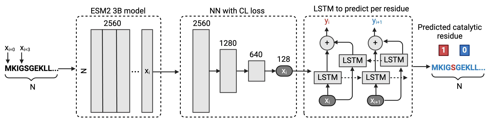

# 🦑Squidly


Squidly, is a tool that employs a biologically informed contrastive learning approach to accurately predict catalytic residues from enzyme sequences. We offer Squidly as ensembled with Blast to achieve high accuracy at low and high sequence homology settings.

publication:
blah

## 📥 Installation
### Requirements
Squidly is dependant on the ESM2 3B or 15B protein language model. Running Suidly will automatically attempt to download each model.
The Smaller 3B model is lighter, runs faster and requires less VRAM. 

Table with requirements:
3B: 
15B: 

### Installation Steps
```bash
# Clone the repository
git clone https://github.com/yourusername/Squidly.git
cd repo-name

# Install dependencies
pip install -r requirements.txt 
```

Torch with cuda 11.8+ must be installed.

## Usage


### Parameters


## Data Availability
All datasets used in the paper are available here:
Zenodo:

## Reproducing Squidly
We developed reproduction scripts for each benchmark training/test scenario.

- **AEGAN and Common Benchmarks**: Trained on Uni14230 (AEGAN), and tested on Uni3175 (AEGAN), HA_superfamily, NN, PC, and EF datasets.
- **CataloDB**: Short description: Trained on our proposed training and test set with structural/sequence ID filtering to less than 30% identity.

The corresponding scripts can be found in the reproduction_run directory.

You must choose the pair scheme for the Squidly models:


Scheme 2 and 3 had the sample limit parameter set to 16000, and scheme 1 at 4000000.

